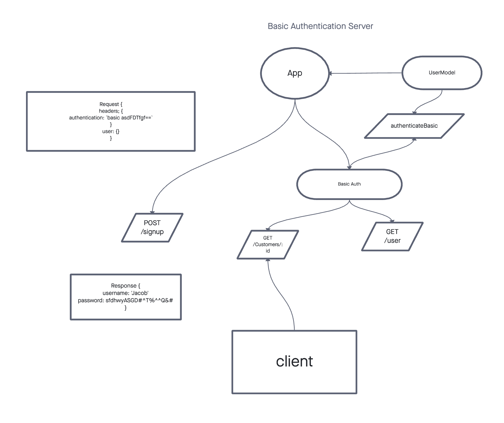

# Bearer-Auth

**Lab 06**
This week we are implementing authorization into our apps.  Supposedely when we get into the wild a lot of this will be automated, but it is fun to learn it all from scratch.

**Lab 07**
For this lab we switched from using a user's details (encrypted) to authenticate, to generating and using a **J**SON **W**eb **T**oken.  
We were once again given starter code, this time there was a lot more code and also a lot more bugs to find and fix.

PR links can be found at the bottom of this document[^1]

[GitHub Repo](https://github.com/AndresMillsGallego/bearer-auth)

[Heroku Deployed Link](https://andresmills-bearer-auth.herokuapp.com/)

## Installation

To install this app just follow these steps:

- Clone down this repo
- CD into your new directory
- npm install

And that is it!

[Sequelize Docs](https://sequelize.org/)
[JWT Docs](https://jwt.io/introduction)
[JWT Repo](https://github.com/auth0/node-jsonwebtoken)

## Usage

A good introduction to the inner workings of sequelize, postgres and how to create and use the database.  To add to this, we are working on implementing authorzation into our apps, so that only an authorized user can access their account / db.

Authentication and Authorization are both integral parts of many web apps.  While it is true that many of these systems are automated, this app provides a good chance to practice implementing an app with `bearer auth` in it's routes.

## Contributors / Authors

Project by: Andres Mills Gallego

[My GitHub](https://github.com/AndresMillsGallego)

[My LinkedIn](https://www.linkedin.com/in/andres-mills-gallego/)

## Features / Routes

I used `sequelize`, `postgres`, `express`, `jest` to build and test this app.  It is a **REST** app and uses `GET`, `PUT`, `POST` and `DELETE` routes.  These are all used in separate Router files for each model.

For authentication I used `base64`, `bcrypt` and tested with `supertest`
I also used `JSONWebToken` to generate and use the `JWT` tokens.

## Pull Requests

[^1]: [Class 06 Pull Request](https://github.com/AndresMillsGallego/bearer-auth/pull/1)
